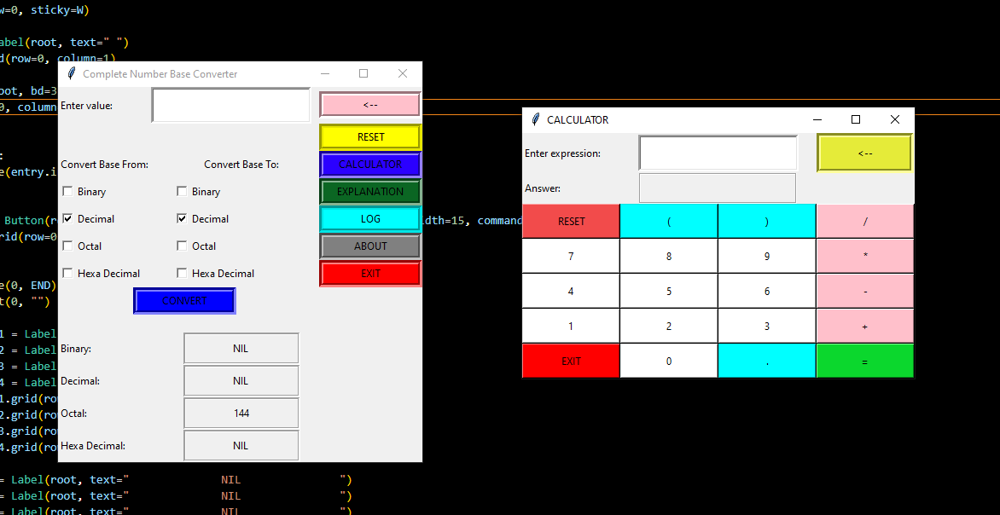

# Number-Base-Converter-App with Python

The application contains a simple function that display the actual function of a conversion of base number. This application is a user-friendly kind of system that can help you understand some new programming techniques.


## Features
- Build In Calculator 
- Decimal to Binary converter
- Octal to binary
- Hex to Binary converter
- Binary to Decimal converter
- binary to Octal
- Binary to Hex converter


## Screenshots




## Run Locally

```Python
  Pip Install tkinter
```


## 🚀 About Me
I'm a full stack developer.


## License
[](https://github.com/tterb/atomic-design-ui/blob/master/LICENSEs)
